# Aesir Agent — 架构图表集（流程图 · 时序图 · UML 图）

> **文档性质**：项目需求规格（[`docs/planning/aesir-agent-sdd-v1.0.md`](../../planning/aesir-agent-sdd-v1.0.md)）的可视化配套产物。
>
> **版本**：v1.0　**日期**：2026-09-14　**状态**：待评审
> **项目**：Aesir（UE5 第三人称 ARPG）— NPC 人格与行为代理系统
> **分工**：dyh（Python Agent 服务、协议与策略）／yjx（UE 战斗与 NPC 行为、指令组件、表现层）
>
> **制图工具**：Mermaid（GitHub 技能 `diagram-creator`，MIT）。
>
> **事实来源与约束**：本图表集所有字段名、枚举值、阶段划分、阈值均取自仓库当前真实代码与配置
> （`app/schemas/*`、`app/api/v1/*`、`data/policy/*.yaml`、`data/companions/*.yaml`），
> **不含任何虚构内容**；"待实现/占位"部分已明确标注。

## 目录

| 编号 | 图名 | 类型 | 主要依据 |
| --- | --- | --- | --- |
| 图 1 | 系统总体架构图 | 流程图 | SDD 第三部分 结构决策 |
| 图 2 | 主入口决策主链路 | 流程图 | FR-021 / FR-024 / FR-025 / FR-028 |
| 图 3 | 自主行为心跳引擎 | 流程图 | FR-020 / FR-022 / FR-023 |
| 图 4 | 记忆体系（分级·淘汰·降级） | 流程图 | FR-006 ~ FR-012 |
| 图 5 | 关系体系（事件驱动·防刷·阶段） | 流程图 | FR-013 ~ FR-018 |
| 图 6 | 玩家指令链路 | 时序图 | US4 / 章程 III |
| 图 7 | 自发行为心跳链路 | 时序图 | US3 / FR-021 |
| 图 8 | 世界事件幂等链路 | 时序图 | US5 / FR-032 ~ FR-034 |
| 图 9 | 核心数据模型 | UML 类图 | Key Entities |
| 图 10 | 关系阶段状态机 | UML 状态图 | FR-016 · relationship_policy.yaml |
| 图 11 | 活动场景状态机 | UML 状态图 | FR-019 |
| 图 12 | 部署拓扑图 | UML 部署图 | 技术约束·运行与部署 |
| 图 13 | 实体关系图（ER） | ER 图 | Key Entities |

---

# 一、流程图（Flowchart）

## 图 1　系统总体架构图

**类型**：Architecture Flowchart　**方向**：TB（上→下）
**用途**：给评审/新成员一张图看懂「谁负责什么、数据怎么流、什么是可选依赖」。
**要点**：UE5 客户端（yjx）是唯一权威端；Python 服务（dyh）只产出受限指令；持久化用本地文件，不引入数据库。

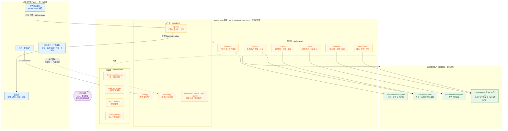

**读图提示**：`solid 边` 为必需链路，`dotted 边` 为可选/旁路（模型降级、回执观测）。
**依据**：章程原则 III（UE 权威）、VII（简单优先）；SDD §第三部分「Structure Decision」。

---

## 图 2　主入口决策主链路

**类型**：Process Flowchart　**方向**：TD
**用途**：说明一次 `/v1/agent/step` 请求从进来到出去的完整判定顺序与失败出口。
**要点**：心跳与指令**共用同一入口**（单一指令体系，FR-045）；任何条件不满足都返回**明确说明而非虚构动作**（FR-025）。

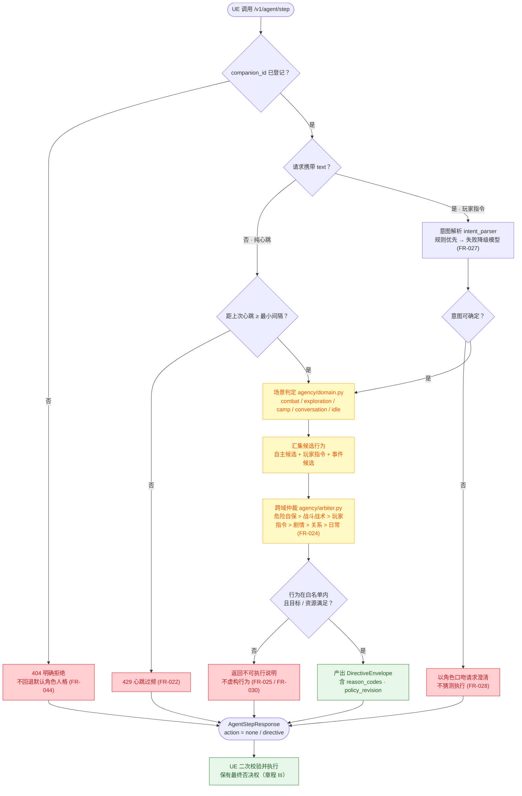

---

## 图 3　自主行为心跳引擎

**类型**：Process Flowchart　**方向**：TD
**用途**：说明"她为什么会在没有命令时动一下"，以及为什么会**不动**。
**要点**：服务**不主动推送**，只在心跳响应里返回（FR-021）；节流 + 去重 + 禁打断三重护栏（FR-022 / FR-023）。

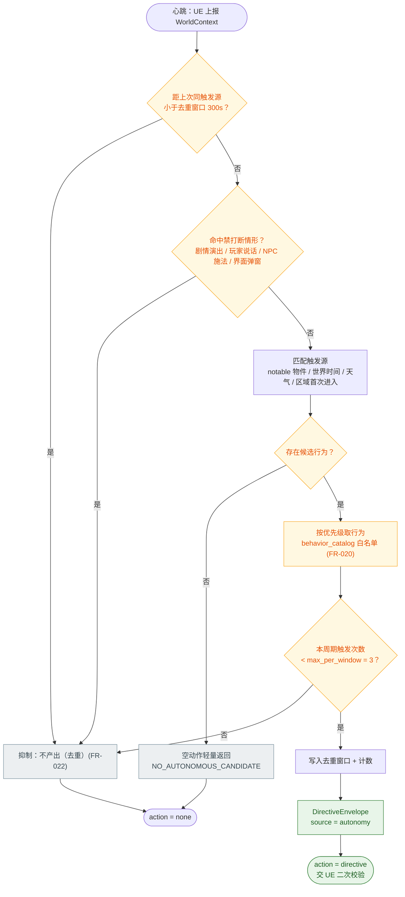

**配置锚点**：`data/policy/agency_policy.yaml` → `throttle.dedup_window_seconds=300`、`max_per_window=3`、`no_interrupt_when=[cutscene_playing, player_speaking, npc_casting, ui_popup]`。

---

## 图 4　记忆体系（分级 · 淘汰 · 降级）

**类型**：Process Flowchart　**方向**：TD
**用途**：说明"她记得我"在实现上如何分层、何时落盘、满了怎么办、坏了怎么办。
**要点**：承诺类/重大事件**优先级高于容量淘汰**（FR-008）；存储不可用时降级为无长期记忆但**流程不中断**（FR-011）。

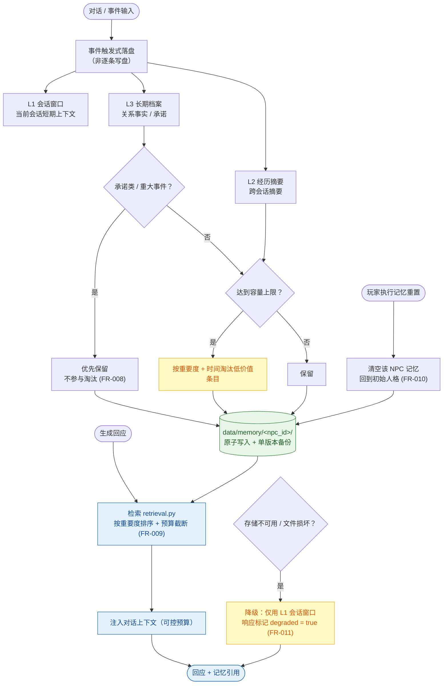

---

## 图 5　关系体系（事件驱动 · 防刷 · 阶段）

**类型**：Process Flowchart　**方向**：TD
**用途**：说明好感度如何由**事实事件**驱动、如何防刷、如何转化为可观察的行为差异。
**要点**：事件表与幅度**全部在 YAML**（章程 I）；同类重复触发数值变化为 **0**（SC-004）。

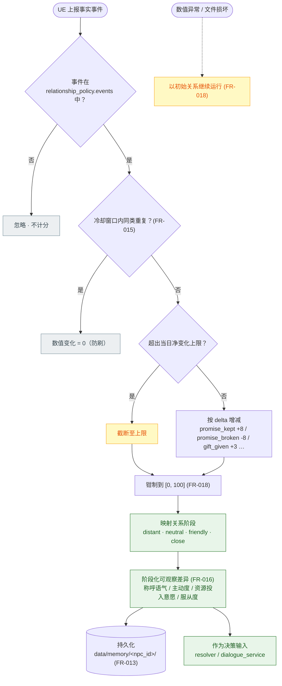

**事件表锚点**：`data/policy/relationship_policy.yaml` → `events`（8 类），`stages`（4 段），`bounds = [0,100], initial=20`。

---

# 二、时序图（Sequence Diagram）

## 图 6　玩家指令链路（文本 / 语音统一）

**类型**：Sequence Diagram
**用途**：答辩主线——一句话指令如何变成 NPC 的行为，以及**为什么**。
**要点**：同一句指令在不同战况/关系阶段产出不同结果（FR-029）；语音转写后与文本走**同一条**后续处理（FR-026）。

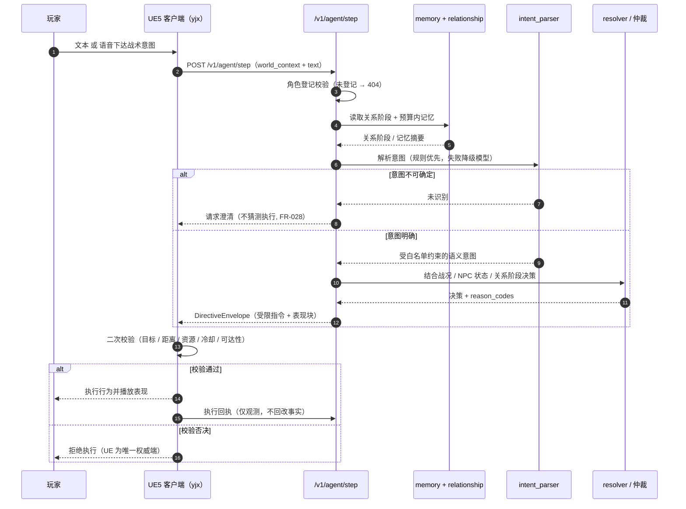

---

## 图 7　自发行为心跳链路

**类型**：Sequence Diagram
**用途**：说明非战斗时 NPC 的自主行为**由 UE 心跳驱动、服务被动响应**，绝不主动推送。
**要点**：`loop` 表示固定间隔心跳；每条心跳都可能以 `action=none` 快速返回（性能目标：无产出 < 100ms）。

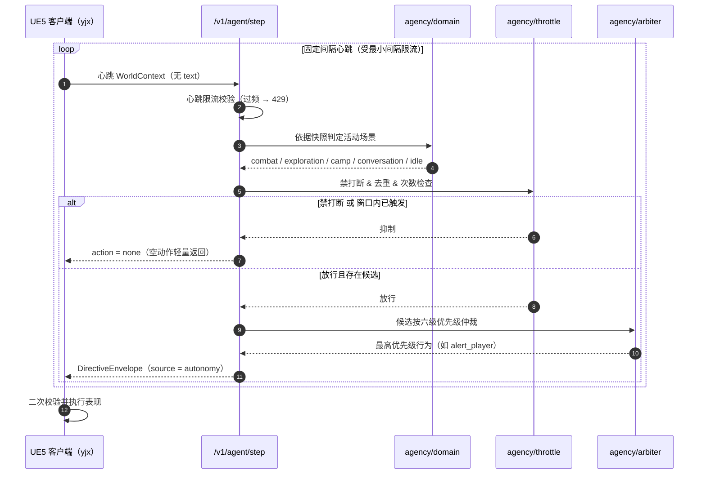

---

## 图 8　世界事件幂等链路

**类型**：Sequence Diagram
**用途**：说明"同一次事件因网络重试被重复上报时**不会复读**"。
**要点**：幂等键 = `companion_id + event_id`（FR-033）；能力不可用时**动作置空但台词与建议照常返回**（FR-037 / FR-025）。

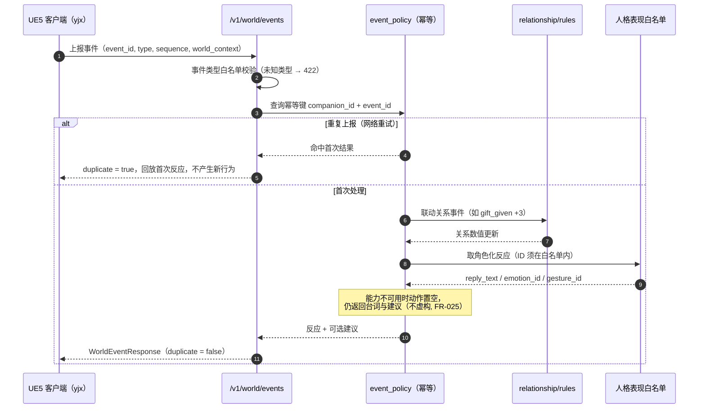

---

# 三、UML 图

## 图 9　核心数据模型（UML 类图）

**类型**：UML Class Diagram
**用途**：开发者的字段级参照，等价于协议 v0.3 的数据契约速查表。
**要点**：字段名与类型与 `app/schemas/` 真实代码一一对应；`&lt;&lt;union&gt;&gt;` 为判别联合。

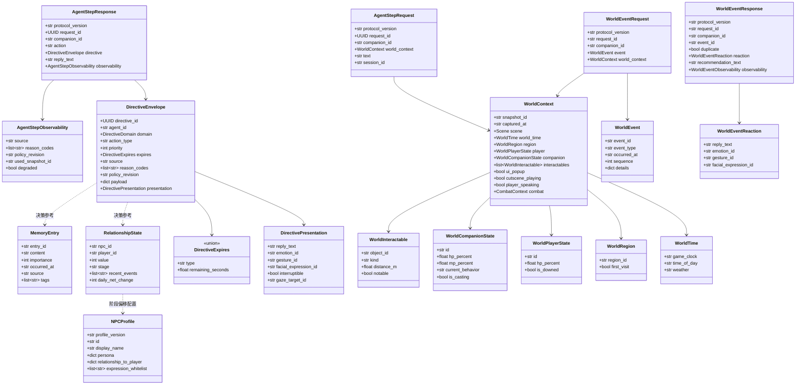

> 说明：`Scene` / `DirectiveDomain` 为同一枚举的两处别名
> （`Literal["combat","exploration","camp","conversation","idle"]`）。
> 图中省略了 `CombatContext`（v0.2 既有契约，未做语义改动）的内部字段。

---

## 图 10　关系阶段状态机（UML 状态图）

**类型**：UML State Machine Diagram
**用途**：说明好感度的状态跃迁与**每阶段的可观察差异**（用于 US2 的独立验收）。
**要点**：阶段命名与区间来自 `relationship_policy.yaml` 真实配置；数值钳制在 `[0,100]`。

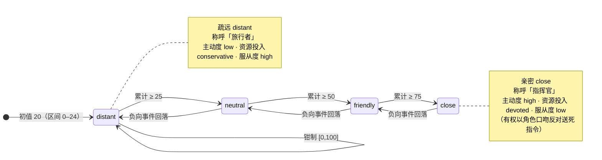

---

## 图 11　活动场景状态机（UML 状态图）

**类型**：UML State Machine Diagram
**用途**：说明五类活动域的切换关系与"战斗域排除生活类行为"的边界。
**要点**：场景由 UE 上报的快照判定（`agency/domain.py`），非法取值 422。

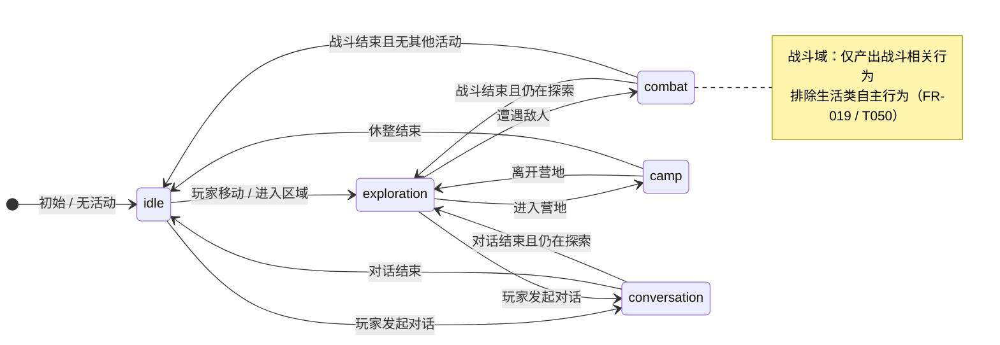

---

## 图 12　部署拓扑图（UML 部署图）

**类型**：UML Deployment Diagram
**用途**：说明"单机回环、无外网也能跑通规则链路"的部署形态。
**要点**：服务仅监听回环地址；持久化用本地文件；模型/语音为**可选**依赖。

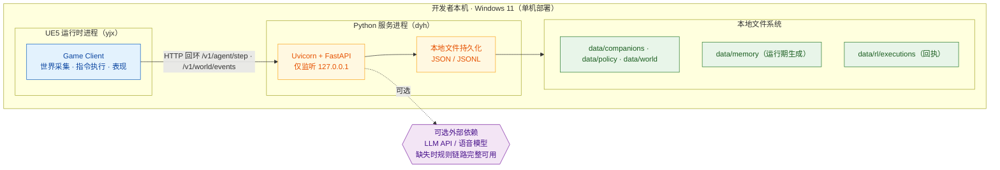

---

## 图 13　实体关系图（ER）

**类型**：ER Diagram
**用途**：Key Entities 之间"谁约束谁、谁生成谁"的数据关系一目了然。
**要点**：无数据库，实体以文件/内存对象落地；`MEMORY_ENTRY` 与 `RELATIONSHIP_STATE` 按 `npc_id` 分区隔离（US8）。

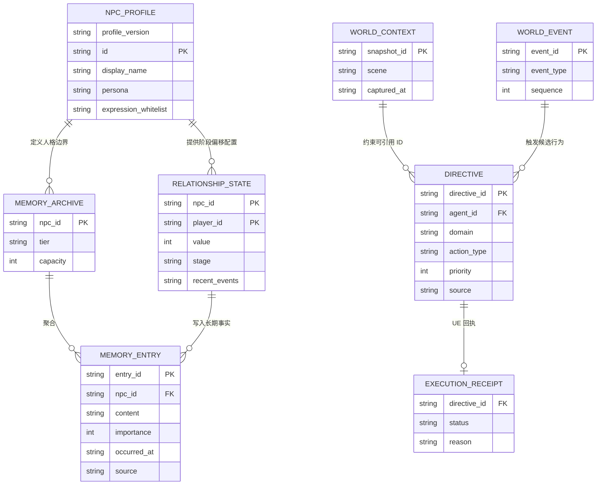

---

# 附录　与需求文档的对应关系

| 图表 | 对应 SDD 章节 |
| --- | --- |
| 图 1 / 图 12 | 第三部分 实施计划 · 结构决策 · 技术上下文 |
| 图 2 | 第二部分 FR-021 / FR-024 / FR-025 / FR-028 / FR-044 |
| 图 3 | 第二部分 FR-020 / FR-022 / FR-023 · US3 |
| 图 4 | 第二部分 FR-006 ~ FR-012 · US1 |
| 图 5 | 第二部分 FR-013 ~ FR-018 · US2 |
| 图 6 | US4 · 章程原则 III |
| 图 7 | US3 · FR-021 |
| 图 8 | US5 · FR-032 ~ FR-034 |
| 图 9 / 图 13 | 第二部分 Key Entities |
| 图 10 | FR-016 · `relationship_policy.yaml` |
| 图 11 | FR-019 · `agency_policy.yaml` |
