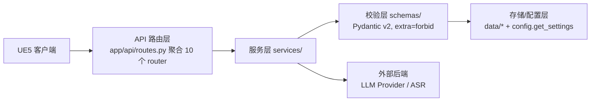

# Aesir AI Service — 命令执行机制解析

> 本文把「玩家一句话指令，如何变成队友在游戏里真正执行的动作，并把结果回流」这条链路完整讲清楚。侧重 **v0.2 组合端点 `/v1/tactical/command`**，同时说明它与 v0.1 旧链路、以及回执闭环的关系。文中所有结论都可对照 `app/` 下源码与 `data/policy/tactical_policy.yaml` 验证。

---

## 0. 目录

1. 系统分层架构速览
2. 命令执行的「两条链路 + 一个闭环」
3. 主力路径全流程（图文）
4. 逐段代码解析
5. 安全闸：能力目录门禁
6. 运行时可切换 + 永不「答不上来」
7. v0.1 旧链路差异
8. 契约数据形态速查
9. 一句话总结

---

## 1. 系统分层架构速览

读懂命令执行，先看清它处在哪一层。服务是一个典型的 FastAPI 分层结构：**请求自顶向下单向流动，每层只依赖下一层**。



- **API 层**（`app/api/`）：`routes.py` 是唯一聚合点，集中 include `health / commands / companion / voice / speech / tactical / combat / agent / world / console` 共 10 个 router；新增端点只改 `app/api/v1/` 并在此 include，不碰 `main.py`。
- **服务层**（`app/services/`）：`companion / tactical / memory / relationship / agency / llm / parsers / transcribers / skills / console` 等子包，承载全部业务逻辑。
- **校验层**（`app/schemas/`）：请求/响应模型，`extra="forbid"` 拒绝任何未声明字段，LLM 或调用方都无法注入多余字段。
- **存储/配置层**：`data/memory`、`data/relationship`（原子写 + 备份 + 损坏隔离）、`data/personas/<game_id>/<companion_id>/`（S2 人格包目录）、`data/games/aesir/capability.yaml`（游戏档案）、`data/policy/tactical_policy.yaml`（战术策略）；运行时配置全部经 `config.get_settings()` 读取。

命令执行相关的代码，主要分布在 **API 层 `tactical.py` / `commands.py`** → **服务层 `parsers/` + `tactical/`** → **校验层 `tactical_*.py` / `directives/`**。

---

## 2. 命令执行的「两条链路 + 一个闭环」

系统里「执行命令」实际由三条接口协作完成：

| 角色 | 端点 | 输入 → 输出 | 协议 |
|------|------|-------------|------|
| **A. 旧版解析**（保留兼容） | `POST /v1/commands/parse` | 文本 + 能力目录 → `TacticalOrder` | v0.1 |
| **B. 组合决策**（主力） | `POST /v1/tactical/command` | 文本 + 战斗快照 → `TacticalDecision` | v0.2 |
| **回执闭环** | `POST /v1/tactical/executions` | 执行结果 → 落 JSONL | v0.2/0.3 |

- 链路 A 是 v0.1 契约，不带战斗快照，只能做「文本 → 固定 order」的浅解析；
- 链路 B 是 v0.2 主力，等于「先 parse 意图、再结合快照 resolve 落地」一次调用，且多了一层上下文决策与可解释 `reason_codes`；
- 回执闭环把 UE 的执行结果回流成数据，供后续 RL 数据筛选（**明确不自动用于训练**）。

下文以 **链路 B（主力执行路径）** 为主轴拆解。

---

## 3. 主力路径全流程（图文）

```mermaid
flowchart TD
    A[UE: POST /v1/tactical/command<br/>{text, combat_context 战斗快照}] --> B[tactical.py::command_tactical]
    B --> C{parse_intent_with_source<br/>rule / llm→rule_fallback}
    C -->|产出 TacticalIntent| D[TacticalIntent<br/>11 个意图白名单]
    D -->|识别不了 → None| Z[澄清回复<br/>recognized=false, 不猜测]
    D --> E[resolve_intent + tactical_policy.yaml<br/>结合战斗快照]
    E --> F[TacticalDecision<br/>{status, action, reason_codes}]
    F --> G[create_tactical_acknowledgement<br/>→ companion_reply]
    G --> H[ResolveResponse → UE]
    H --> I[UE 执行 DecisionAction<br/>按 order_id 关联, UE 有最终否决权]
    I --> J[POST /v1/tactical/executions<br/>单条/批量, 202 受理]
    J --> K[receipt_store.append_receipt<br/>按天追加 JSONL]
```

整条链路没有一条路径会抛裸 500 中断玩家流程：识别不了回澄清、不可执行回 `not_actionable`、LLM 失败回退规则。

---

## 4. 逐段代码解析

### 4.1 入口路由：`app/api/v1/tactical.py`

`command_tactical()` 是组合端点。它先调 `parse_intent_with_source()` 出意图；若意图是 `None`，**直接返回一个 `recognized=false` 的澄清回复**（「我没听清你想让我做什么，能再说一遍吗？」），绝不猜一个动作。

### 4.2 文本 → 语义意图：`TacticalIntent`

`parse_intent_with_source()`（`app/services/tactical/llm_intent.py`）按环境变量 `AESIR_INTENT_BACKEND` 选后端：

- **rule（默认）**：`intent_parser.parse_text_to_intent()` —— 确定性关键词匹配。先过**唤醒词**（`艾莉/艾琳/alice/eirin`，可从人格包动态取），没唤醒词直接 `None`；命中后按**优先级降序**判序：

  ```
  撤退 > 等眩晕爆发 > 治疗 > 保护 > 爆发 > 集火 > 跟随 > 拾取/查看/休整/等待
  ```

  输出受 `Literal` 白名单约束的 11 种 `TacticalIntent`。
- **llm**：`parse_text_to_intent_llm()` 让 LLM 产出严格 JSON，再喂给 `TacticalIntent` 校验；**任何失败**（配置缺失 / 网络 / 枚举越界）都被 `except` 后回退规则解析，`source` 标成 `rule_fallback`。

> 这一步**只回答「玩家想做什么」**，不承诺施放哪个技能——技能由下一步结合快照决定。这是 v0.2「意图理解与上下文战术落地」的分层原则。

### 4.3 意图 + 快照 → 上下文决策：`TacticalDecision`

`_resolve_response()` → `resolve_intent()`（`app/services/tactical/resolver.py`）是核心：

- 用 `handlers` 字典把 `intent_id` 分发到 `_heal / _protect / _burst / _retreat / _follow`；
- 每个 handler 都先查 `CombatContext`：只看快照里 `ability_states == "ready"` 的能力（`is_ability_ready`），阈值（玩家 HP 危急/偏低、艾莉 MP 过低、贴脸判定）全部来自 `data/policy/tactical_policy.yaml`，**代码里不再写死字面量**；
- 产出 `TacticalDecision`，含 `status`（`actionable` / `not_actionable` / `advisory` / `clarification_needed`）、`DecisionAction`（`order_id`、`type`、`ability_id`、`target_id`、`priority`、`expires`、`authority`）、以及**可解释的 `reason_codes` + `explanation`**；
- 能力没就绪或玩家血量健康 → `status="not_actionable"`，**宁可不动也不乱放**（例：「玩家生命值健康，暂不需要治疗」）；
- 若传了 `relationship_stage`，还会经 `modulate_decision()` 用关系阶段调制资源投入意愿（US2）。

### 4.4 挂队友确认回应

`create_tactical_acknowledgement(intent_id, companion_id)`（`app/services/tactical/acknowledgement_service.py`）从人设 YAML 的 `tactical_acknowledgements` 读对应短回复，并校验 `emotion_id` 落在角色白名单内。缺失/越界返回 `None`，由调用方回退默认文案（「收到。」）。这样**路由层不承载人设文案**。

### 4.5 响应回 UE

`ResolveResponse` 带 `recognized / source / decision / companion_reply / observability` 回给 UE。UE 拿到 `DecisionAction` 按 `order_id` 执行——注意 `authority` 只声明来源，**UE 永远有最终否决权**。

### 4.6 回执闭环（执行结果回流）

UE 执行完把结果通过 `POST /v1/tactical/executions` 回报：单条 `{"receipt": {...}}` 或批量 `{"receipts": [...]}`（schema 用 `model_validator` 保证二选一）。`record_execution()` 返回 202「受理」，再交给 `append_receipt()`（`app/services/tactical/receipt_store.py`）：

- 按**天**分文件 `{receipts_dir}/{game_id}/{YYYYMMDD}.jsonl`，只追加、UTF-8（避开 Windows GBK 炸中文 `reason_code`）；
- `ExecutionReceipt` 含 `order_id / result(accepted|executed|rejected|expired|cancelled) / encounter_id / reason_code / policy_revision` 等；
- 这批数据是给**后续 RL 数据筛选**用的，**草案 §7 明确不自动用于训练**。

---

## 5. 安全闸：能力目录门禁（FR-040）

这是「执行命令」最该记住的护栏。无论是 v0.1 的 `RuleCommandParser` 先构造 `_Catalog`（能力/目标/状态 ID 是否都在 UE 上传的 `context` 里），还是 v0.2 的 `resolver` 只引用快照里 `ready` 的能力——**所有下发的 `ability_id / target_id` 都必须来自 UE 当次提供的目录，服务绝不自己发明 ID**。

因此 UE 端永远不会因为收到一个不存在的技能 ID 而崩溃，协议天然「UE-safe」。

---

## 6. 运行时可切换 + 永不「答不上来」

- `parser_backend / intent_backend / tactical_policy` 全由 `get_settings()` 读环境变量决定（`AESIR_` 前缀），**每次调用重建实例、不缓存**，改 `.env` 即时生效，测试用 `monkeypatch.setenv` 也不串味。
- LLM 任意环节失败都回退规则；识别不了回澄清、不可执行回 `not_actionable`。整条链路**没有一条路径会抛裸 500 中断玩家流程**。

---

## 7. v0.1 旧链路差异（链路 A）

`/v1/commands/parse` 走 `command_parser.parse_command()` → `RuleCommandParser`（`app/services/parsers/rule.py`）：产出 v0.1 的 `TacticalOrder` 判别联合（`ConditionalCast / HoldAbility / PrioritizeAttack / FollowKeepDistance / Retreat`），用 `when/then/expires` 描述，优先级同样降序（撤退 90 > 条件施法 80 > 保留 60 > 优先普攻 50 > 跟随 40）。它**不带战斗快照**，所以只能做浅解析；v0.2 端点等于「先 parse 再 resolve 一次调用」，且多了上下文决策与 `reason_codes`。

> 旧端点保留是为了老客户端兼容，新联调应走 `/v1/tactical/command`。

---

## 8. 契约数据形态速查

**`TacticalIntent`**（语义意图，只答「想做什么」）

```
intent_id: Literal[11 种]      # support_heal_player / support_protect_player / burst_boss /
                               # prepare_burst_on_stun / focus_fire_boss / retreat_and_survive /
                               # follow_player / inspect_interactable / pickup_item / rest_here / wait_here
target_id: str                 # 如 "party.player" / "encounter.primary_hostile"
timing: immediate|on_condition|when_possible
preferences: {strength, resource_conservation}
```

**`TacticalDecision` / `DecisionAction`**（上下文决策产物）

```
TacticalDecision {
  status: actionable|advisory|not_actionable|clarification_needed
  action: DecisionAction | None
  reason_codes: list[str]      # 可解释依据，如 PLAYER_HP_CRITICAL / MAJOR_HEAL_READY
  explanation: str
}
DecisionAction {
  order_id, agent_id, type: cast_ability|hold_ability|set_priority|follow|retreat
  ability_id?, target_id?, priority, expires, authority
}
```

**`ExecutionReceipt`**（UE 回传的执行结果）

```
order_id, result: accepted|executed|rejected|expired|cancelled
encounter_id, request_id?, reason_code?, agent_id?, ability_id?
policy_revision?, received_at?   # 服务端受理时间缺省时自动补
```

**`TacticalOrder`（v0.1 旧契约）**：`intent` 判别联合 + `when/then/expires`，仅含 5 种固定意图，无战斗快照上下文。

---

## 9. 一句话总结

**命令执行 = 文本经「意图解析（rule/LLM，可降级）」变成语义意图，再经「上下文决策器（只读战斗快照 + 策略 YAML）」落地为带可解释理由的 `DecisionAction`，全程受 UE 能力目录门禁保护；UE 执行后把结果以回执形式追加进 JSONL，形成闭环。**

---

> 文档位置：`docs/guides/command-execution.md`（非 `docs/planning/`）。相关源码：`app/api/v1/tactical.py`、`app/api/v1/commands.py`、`app/services/parsers/*`、`app/services/tactical/*`、`app/schemas/tactical_*.py`、`app/schemas/directives/*`、`app/config.py`、`data/policy/tactical_policy.yaml`。
