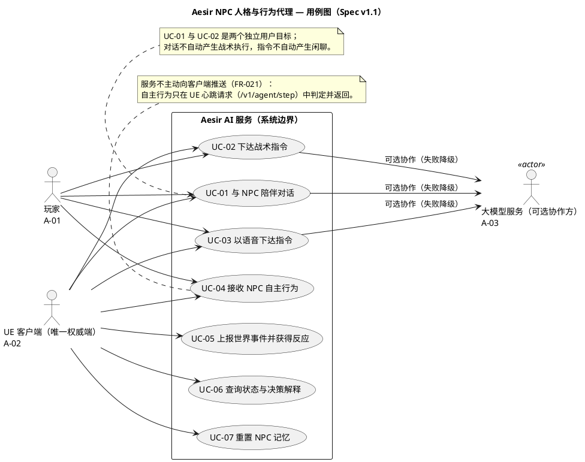
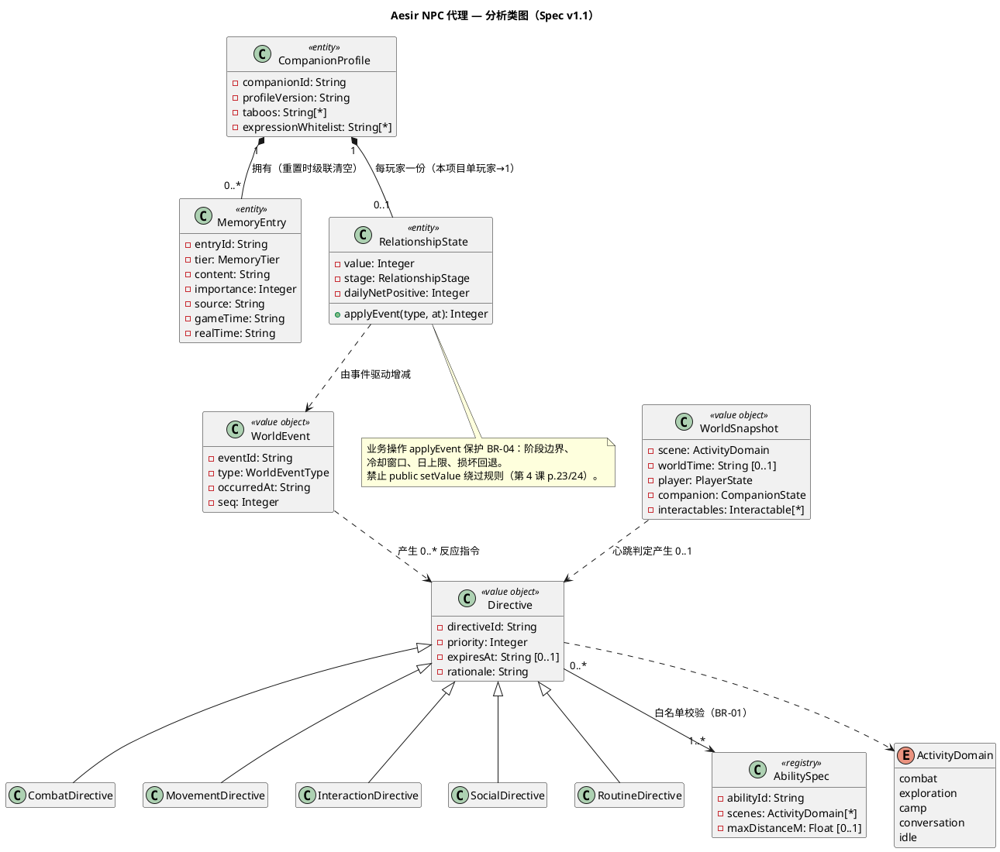
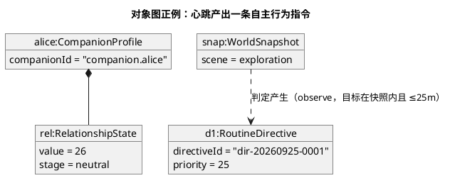

# Aesir Agent — 需求规格说明书 v1.1（课程 Spec 结构修订版）

> **版本**：v1.1　**日期**：2026-09-25　**状态**：待评审
> **项目**：Aesir（UE5 第三人称 ARPG）— NPC 人格与行为代理系统
> **建模主体（系统边界）**：Python AI 服务（本仓库 `aesir-ai-service`），UE 客户端在边界外。
>
> **本版与 v1.0 的关系**：
> - v1.0（`aesir-agent-sdd-v1.0.md`）**原样保留**，是本版的输入与修订对象；
> - 本版按课程规范（第 3 课「用例模型与 Spec 驱动的 AI 建模」v2.1、第 4 课「对象模型与 Spec 驱动的 AI 建模」v2.2）**重写需求规格部分**：补 H0 人工基线（范围/非范围/角色/BR/AT/来源/待确认）、用例模型（图＋描述）、对象模型（候选＋CRC＋分析类图＋追踪）；
> - **项目章程、实施计划、任务分解（T001～T088）沿用 v1.0 对应部分，编号与内容不变**；旧编号（US1～8 / FR-001～045 / SC-001～013）通过第五部分映射表保持可追溯；
> - 代码已实现 US1～US8（CHANGELOG 锚点：2026-09-24，669 通过＋2 跳过）。本版把 v1.0 中「计划口吻」的需求表述修订为「已实现基线＋人工确认值」，并把代码与文档的差异逐项登记在第六部分，不静默选边。

---

# 第一部分　H0 人工需求基线

> 对应第 3 课评分项 H0（30 分）：范围、非范围、角色目标、规则与验收，全部要求「有来源、人工确认、可判真伪」。

## 1.1 范围表（系统边界：Python AI 服务）

| 编号 | 本轮明确做什么 | 来源 |
| --- | --- | --- |
| IN-01 | 陪伴对话（`/v1/companion/chat` 与 SSE 流式）：人格化表达、记忆注入、关系化语气、表达合规校验 | 项目任务转变（教师要求：从「语音识别转 JSON 命令」升级为「塑造 NPC 完整人格并负责其活动塑造」）；策划书 `game-design-doc-v0.1.md` |
| IN-02 | 战斗战术指令决策（`/v1/tactical/*`、`/v1/agent/step` 携带 `text`）：同一意图随战况/关系产生不同且可解释的结果 | 契约 v0.2 `combat-tactical-protocol-v0.2.md`；SDD v1.0 US4 |
| IN-03 | 语音指令转写与解析（`/v1/voice/command`）：转写后进入与文本一致的处理链 | 契约 v0.1 `ue-protocol-contract-v0.1.md` |
| IN-04 | 心跳驱动的非战斗自主行为判定（`/v1/agent/step`）：禁打断 → 候选 → 仲裁 → 节流 → 受限指令 | SDD v1.0 US3 |
| IN-05 | 世界事件接收与 NPC 反应（`/v1/world/events`）：边沿触发、幂等回放 | SDD v1.0 US5；协议 `protocol_version=0.3` |
| IN-06 | 调试台（`/v1/console/state`、`/memory`、`POST /memory/reset`）：状态查询与指定角色记忆重置 | SDD v1.0 US7、FR-010 |
| IN-07 | 多角色路由与状态隔离：按 `companion_id` 路由，记忆/关系按角色隔离 | SDD v1.0 US8；2026-09-24 实现记录（Alice＋Bruno 骨架） |

**内部责任**（边界内职责，不画参与者）：分级记忆持久化与淘汰；关系数值计算、阶段划分与防刷；指令白名单校验与三重校验；事件幂等缓存；配置加载与非法快速失败。

**外部交互方**：A-01 玩家、A-02 UE 客户端、A-03 大模型服务（见 1.3）。

## 1.2 非范围（本轮明确不做，AI 无权添加）

| 编号 | 本轮明确不做 | 依据 |
| --- | --- | --- |
| OUT-01 | 多用户并发、账号体系、联网对战、跨设备记忆同步 | SDD v1.0 Assumptions 第 1/6 条 |
| OUT-02 | NPC 人格自主演化、由模型输出或玩家输入改写核心设定 | FR-005；Assumptions 第 7 条 |
| OUT-03 | 数据库、消息队列、向量库等重型中间件；绑定公网部署 | 章程原则 VII；技术约束「仅监听回环」 |
| OUT-04 | 服务直接改变游戏世界状态（血量、伤害、位移、技能合法性裁定） | FR-039；章程原则 III（UE 唯一权威端） |
| OUT-05 | 对话 RL「导演层」在线学习进入交付范围 | SDD v1.0 演进路线补记仅做登记；未经批准不进入需求（第 3 课 p.68：新建议单列） |
| OUT-06 | Boss 战 RL 并入本服务需求主线 | 独立旁路（yjx 侧，`rl/boss/`），与本规格解耦 |

## 1.3 参与者：角色—目标—权限

> 先找到真实交互，再确定参与者（第 3 课 p.27）。内部算法、配置、本地 ASR 模型不自动成为参与者。

| 编号 | 角色 | 定义 | 目标 | 对谁的资源可操作 / 权限边界 |
| --- | --- | --- | --- | --- |
| A-01 | 玩家 | 终端用户，**经 UE 客户端间接**使用本服务 | 与 NPC 自然相处（对话、被记住、关系成长）；战斗与非战斗中以自然语言指挥 NPC | 可提交自己的输入、经调试台发起记忆重置；**不可**直接改写 NPC 核心人格（BR-10）、不可直接设定关系数值（BR-04） |
| A-02 | UE 客户端 | 游戏客户端，**直接调用方、唯一权威端** | 上报世界快照/事件、获取受限行为指令与反应、执行或否决指令 | 可读写自己的世界状态；对本服务的全部端点可调用；**保有对指令的最终否决权**（BR-01）；服务不得回写其权威状态 |
| A-03 | 大模型服务 | 系统边界外的外部 LLM API（可选依赖） | 提供文本生成与对话信号判断 | 只返回文本与信号；**输出不可信**，须经三重校验后才允许影响游戏（BR-02）；不可用时服务以规则链路降级（NFR-03） |

> 同一自然人不会兼任两个系统角色；不设角色泛化（第 3 课 p.26：不能由「同一人可兼任」推出继承）。

## 1.4 功能需求清单（REQ 编号稳定，映射用例）

| 需求 ID | 用户目标 | 参与者 | 映射用例 | 旧编号依据 |
| --- | --- | --- | --- | --- |
| REQ-01 | 与 NPC 陪伴对话（文本/流式），被记住、被以关系化方式对待 | A-01（经 A-02） | UC-01 | US1/US2 对话面；FR-001～005 |
| REQ-02 | 下达战术指令并获得随情境变化、可解释的决策 | A-01（经 A-02） | UC-02 | US4；FR-026～031 |
| REQ-03 | 以语音下达指令，转写后与文本同链处理 | A-01（经 A-02） | UC-03 | US4；FR-026；契约 v0.1 |
| REQ-04 | 玩家无指令时，NPC 基于世界状态自主行动且不打扰 | A-01（经 A-02） | UC-04 | US3；FR-019～025 |
| REQ-05 | 上报世界事件，获得一次恰当且不重复的反应 | A-02 | UC-05 | US5；FR-032～034 |
| REQ-06 | 查看 NPC 当前状态与某次决策的完整解释 | A-02（演示/评审场景） | UC-06 | US7；FR-031/042 |
| REQ-07 | 重置指定 NPC 的记忆（玩家希望重新开始） | A-02 | UC-07 | US1；FR-010 |
| REQ-08 | 多角色路由与状态隔离（横切，无独立用例） | A-02 | 落实于 UC-01/02/04 | US8；FR-044 |

> 反向追踪约定：图中每个用例必须有 REQ 依据；REQ-08 是横切需求，落实位置在 UC-01/02/04 的 `companion_id` 处理与 BR-08。

## 1.5 业务规则（BR：全部可判真假，数值为人工确认值）

> 第 3 课 p.53：规则必须能判真伪。下列数值均有来源；此前 v1.0 未锁定的参数，本版按已生效的配置与人工拍板记录，不再「待确认」。

| 编号 | 完整规则 | 来源（人工确认） |
| --- | --- | --- |
| BR-01 | 服务只读世界：下发的行为指令只能引用**本次交互上下文中已存在**的标识（角色、目标、能力、行为类型），越界一律拒绝、不得静默替换；其中 `action_type` 使用统一信封白名单枚举校验，未知类型在服务端降级为空动作；UE 保有最终否决权，即使服务声明「可执行」 | FR-039/040；`app/schemas/directives/common.py`；章程原则 III |
| BR-02 | 外部输入（玩家文本/语音转写）进入 LLM 前须做不可信数据封装（固定分隔符 + 转义 + system prompt 声明），防止提示词注入被模型误作指令执行；模型输出三重校验：**结构校验（`extra=forbid`）→ 标识白名单 → 人设一致性校验**；任一层失败按「重试一次 → 规则回退 → 安全候选 → 明确拒绝」降级，并在响应 `source` 字段留痕 | 章程原则 II；`app/services/llm/untrusted_input.py` |
| BR-03 | 世界事件幂等：同一 `event_id` 重复上报时回放首次结果并标记重复，**不产生第二次实际行为**；反应仅由状态边沿变化触发，不依赖逐帧上报 | FR-033/034；`world_event.py`（协议 0.3） |
| BR-04 | 关系规则：数值 0～100、初始 20；阶段 distant[0,24] / neutral[25,49] / friendly[50,74] / close[75,100]，各阶段须可观察地区分称呼、主动度、资源投入意愿、服从度；增减只由**事实事件＋对话情感信号**驱动（事件表见 `relationship-policy-001`，含 8 类事实事件与 4 类对话信号）；同类事实事件冷却 60 秒、对话信号冷却 300 秒；每日正向净变化上限 15、负向不限；数据损坏回退 20 继续服务 | `data/policy/relationship_policy.yaml`；`app/config.py`；**2026-09-22 用户拍板**「信号走 LLM 顺带返回；五档含负面；半天~一天一档」（CHANGELOG） |
| BR-05 | 记忆规则：短期上下文 ≤50 条、经历摘要 ≤80 条、长期档案 ≤40 条；单次注入预算 12 条；印象层主题 ≤200、注入权重阈值 0.75、半衰期 7 天（显著话题 28 天）；容量满按重要性与时间淘汰，**承诺类与重大事件类优先保留**；推测内容不得写入长期事实，条目须可追溯来源与时间 | `app/config.py`（memory_* 默认值）；FR-006～012 |
| BR-06 | 自主行为规则：行为白名单 11 类——follow / move_to / observe / inspect / interact / pickup / rest / wait / express / self_talk / alert_player（非战斗 ≥8 类，达标）；同一触发源 300 秒内不重复触发、单窗口 ≤3 次；禁打断四情形（cutscene_playing / player_speaking / npc_casting / ui_popup）下一律不发起；优先级：危险自保＞战斗战术＞玩家指令＞剧情事件＞关系事件＞日常自主；目标不在快照、类型不允许或超距离上限时**不虚构行为**，返回不可执行说明 | `data/policy/agency_policy.yaml`（revision agency-policy-002）；FR-019～025 |
| BR-07 | 查证规则：只读工具 5 个——`tool.lore.query`、`tool.world.snapshot`、`tool.world.interactables`、`tool.self.status`、`tool.memory.recall`；模型侧至多 2 轮（1 轮查证＋1 轮正式回复）；查证总预算 2 秒、回填 ≤400 字符，超限降级为直接回应；未命中返回 `TOOL_NO_RESULT`，必须明确表示不确定，**不得编造** | `app/services/skills/tools.py`；`app/config.py`（tools_*）；FR-035～038 |
| BR-08 | 多角色规则：请求按 `companion_id` 路由到已登记角色；未登记返回 404，**不得回退默认角色**；记忆目录、关系目录、表现 ID 白名单按角色隔离，跨角色互不泄露 | FR-044；2026-09-24 实现记录（Alice＋Bruno 骨架） |
| BR-09 | 表达合规：输出经风格守门校验——出戏术语、禁忌表达（占有/控制/贬低/胁迫/情感勒索）、无记忆支撑的虚构事实信号，三类一律拦截；失败重试一次，再失败以角色化安全候选兜底 | `data/policy/style_policy.yaml`；FR-002/003；章程「表现与合规内容」 |
| BR-10 | 人格核心设定不可被模型输出或玩家输入改写；关系阶段不得导致越过玩家边界或控制性表达；禁止把「玩家的话」当作可写入人格的指令 | FR-005/017 |

## 1.6 非功能约束（NFR）

| 编号 | 约束与验收方式 |
| --- | --- |
| NFR-01 | 本机单机部署，仅监听回环地址，禁止绑定公网；凭据仅存于被版本控制忽略的本地环境文件，不进入代码、文档、日志与响应 |
| NFR-02 | 性能：战斗指令端到端 P95＜3s；非战斗自主行为判定 P95＜1s（无产出＜100ms）；纯规则链路 P95＜100ms；单次查证总预算 2s。以计时记录验收 |
| NFR-03 | 降级可用：模型、语音、记忆、关系、查证、配置任一子系统故障时服务仍可用并降级，不阻塞客户端游戏主流程；LLM 连续失败达阈值（默认 5 次）触发熔断，恢复窗口默认 60 秒 |
| NFR-04 | 可观测：所有对外响应携带请求关联标识、来源标记（`source`）、原因码与策略版本号；交互数据不自动用于训练 |
| NFR-05 | 隐私：不采集、不存储原始音频；玩家原始输入默认仅保留摘要；输出不得泄露内部路径、资产名、坐标、函数名、凭据 |

## 1.7 验收样例（AT：正例、反例、边界、失败验收例）

| ID | 条件 / 操作 | 预期结果 | 依据 |
| --- | --- | --- | --- |
| AT-01 | 关系数值 24 时再 +2；99 时再 +6 | 24→26 跨入 neutral；99→100 后不再增加，不越界 | BR-04 |
| AT-02 | 同一事件 10 秒内连续触发 3 次；当日正向已累计 15 后再发生 +6 事件 | 冷却窗口内重复不计分；当日净变化封顶 15，超出部分为 0 | BR-04 |
| AT-03 | 对话信号：300 秒内连续两轮 warm；mock/回退路径的对话 | 第二轮不计分；mock/回退路径不产生关系变化 | BR-04 |
| AT-04 | 以同一 `event_id` 连续上报两次世界事件 | 第二次回放首次结果并标记重复，不产生新行为 | BR-03 |
| AT-05 | 写入「玩家怕高」→ 完整重启服务与进程 → 再对话询问 | NPC 正确引用，抽样 ≥20 条正确率 100% | BR-05；SC-001 |
| AT-06 | 同触发源 300 秒内第二次满足自主行为条件；剧情演出中满足条件 | 均不产出新行为 | BR-06 |
| AT-07 | 指令引用当前上下文不存在的能力/目标 ID（**失败验收例**） | **拒绝并说明原因，不得静默替换为目录内其他能力**；若实际表现为「擅自替换并执行」→ 验收失败 | BR-01；SC-009 |
| AT-08 | 提问有据可查的设定 / 无据可查的设定 | 前者与 `lore.yaml` 一致；后者明确不确定，编造率 0 | BR-07；SC-008 |
| AT-09 | 请求未登记的 `companion_id`；用角色 B 的会话读角色 A 的记忆 | 404 且不回退默认角色；跨角色记忆零泄露 | BR-08；SC-012 |
| AT-10 | LLM 连续失败 5 次后立即再请求对话 | 熔断 OPEN，走规则/mock 兜底，响应照常且 `source` 标记降级 | BR-02；NFR-03 |
| AT-11 | 记忆目录不可写/文件损坏后继续对话 | 服务可用，降级为无长期记忆，游戏流程中断 0 次 | BR-05；NFR-03 |
| AT-12 | 重置角色 A 记忆后再对话 | 角色 A 回到初始人格状态、无旧记忆残留；角色 B 不受影响 | REQ-07；BR-08 |

## 1.8 人工确认记录与待确认项

| 字段 | 记录 |
| --- | --- |
| 基线版本 | Spec v1.1（修订自 v1.0；v1.0 原样保留） |
| 需求来源 | ① 教师项目要求转变（塑造 NPC 完整人格，SDD v1.0 Input）；② 策划书 `game-design-doc-v0.1.md`；③ 契约 v0.1/v0.2；④ 2026-09-21～22 真实会话试玩复盘与逐项用户拍板（CHANGELOG 五修/六修/七修、对话推动关系）；⑤ 生效配置 `data/policy/*.yaml` |
| 需求负责人 / 审阅人 | dyh（Python 服务）／yjx（UE 侧）——**待签署** |
| 批准时间 | 待签署时填写 |

**待确认项（标【待确认】，未批准前 AI 不得补成事实）**：

1. 【待确认】UE 侧战术订单执行链接线证据：`TacticalOrder → Alice BT/技能执行` 未核验（GAP-BP-001/002/003）。当前只能声称「Python 侧产出受限指令」，不能声称「UE 已执行」。
2. 【待确认】SC-011「即时」的量化测量方式与采样方法（当前只有人工评估 ≥95% 的口径）。
3. 【待确认】协议 0.3 是否独立成文：当前以附录形式并入 `ue-protocol-contract-v0.1.md` 与 v0.2 文档，未单独发布 v0.3 契约。
4. 【待确认】对话 RL「导演层」是否立项（OUT-05 已排除于本轮）。
5. 【待确认】关系阶段对外展示的中文命名口径（配置值为 distant/neutral/friendly/close）。

---

# 第二部分　用例模型

> 对应第 3 课：用例图＋用例描述。编号稳定；关系线按业务证据使用，本模型**不使用 include/extend/泛化**（理由见 2.3）。

## 2.1 用例清单与边界说明

- 系统边界：Python AI 服务（方框内）；UE 客户端、玩家、大模型服务在边界外。
- 玩家（A-01）是用户目标的属主；UE 客户端（A-02）是全部用例的直接发起者；大模型服务（A-03）是 UC-01/02/03 的可选协作方。

## 2.2 用例图（PlantUML 源）

## 2.3 关系决策（为何没有 include/extend/泛化）

- 「已上报快照」是 UC-04/05 的**前置条件**，不是每次心跳都 include 一个「上报快照」用例（第 3 课 p.39：已登录可作前置，不等于每步 include 登录）。
- 「语音转写」是 UC-03 基本流的一个步骤，不抽为独立用例（界面/技术动作没有独立业务价值）。
- 「查询天气/战况」等查证是 UC-01 事件流内的工具调用（BR-07），不是独立用例。
- A-01 与 A-02 之间不画泛化：一个是人、一个是系统，不存在契约继承。

## 2.4 核心用例描述表

> 每张表含触发、前置、编号基本流、异常、成功/失败后置与依据（第 3 课 p.48/52）。

### UC-01 与 NPC 陪伴对话

| 字段 | 内容 |
| --- | --- |
| 参与者 / 触发 | 主：A-01 玩家（经 A-02）；协作：A-03（可选）。玩家提交一条对话文本（`/v1/companion/chat` 或 SSE 流式） |
| 前置条件 | `companion_id` 已登记；人格配置可加载 |
| 基本流 | ① UE 提交对话文本与 `companion_id`；② 服务校验结构并路由到该角色人格；③ 检索记忆与关系阶段注入生成上下文；④ 生成回复与对话信号，经三重校验（BR-02）与表达合规校验（BR-09）；⑤ 返回回复（含 `source`、关系增量、策略版本）；⑥ 本轮记忆与关系信号落库 |
| 备选 / 异常 | 1a 未登记角色：404，不回退默认（BR-08）。4a 校验失败：重试一次→规则/mock 兜底，`source` 留痕（BR-02）。4b 记忆/关系存储故障：降级为无长期记忆继续对话（BR-05/NFR-03）。6a 对话信号冷却中：不计分（BR-04） |
| 成功 / 失败后置 | 成功：玩家得到人格一致、合规的回复，记忆与关系按规则更新。失败：不返回越界/违规内容，不产生部分写入 |
| 依据 | REQ-01；BR-02/04/05/08/09/10；NFR-03/04 |

### UC-02 下达战术指令

| 字段 | 内容 |
| --- | --- |
| 参与者 / 触发 | 主：A-01（经 A-02）；协作：A-03（可选）。玩家提交指令文本与战斗快照（`/v1/tactical/command`，或 `/v1/agent/step` 携带 `text`） |
| 前置条件 | 快照字段合法；能力目录已加载 |
| 基本流 | ① UE 提交文本＋战斗快照；② 意图解析（规则/模型可切换，失败降级）；③ 结合战况、NPC 状态与关系阶段决策；④ 生成受限指令与原因说明；⑤ 返回决策（含原因码、`source`、策略版本） |
| 备选 / 异常 | 2a 意图无法确定：以角色口吻请求澄清，**不猜测执行**（FR-028）。3a 指定能力/目标不可用或越界：拒绝并说明，不静默替换（BR-01，AT-07）。4a 模型不可用：规则链路照常决策（NFR-03） |
| 成功 / 失败后置 | 成功：产出上下文内合法的受限指令，等待 UE 二次校验与执行。失败：无越界指令下发；不虚构动作 |
| 依据 | REQ-02；BR-01/02/04；NFR-02/03 |

### UC-03 以语音下达指令

| 字段 | 内容 |
| --- | --- |
| 参与者 / 触发 | 主：A-01（经 A-02）。玩家提交语音（multipart WAV 16kHz/mono/16bit，`/v1/voice/command`） |
| 前置条件 | ASR 后端可用（或 mock 模式） |
| 基本流 | ① UE 上传音频；② 转写为文本；③ 转写文本进入与 UC-02 完全一致的解析与决策链；④ 返回转写文本与解析结果 |
| 备选 / 异常 | 2a 语音为空/过短/纯噪声：返回空转写与明确反馈，不臆造命令。2b ASR 不可用：明确反馈且战斗流程不受影响（FR-041）。存储纪律：不落盘原始音频（NFR-05） |
| 成功 / 失败后置 | 成功：得到与文本指令等价的处理结果。失败：无臆造命令；不留存原始音频 |
| 依据 | REQ-03；FR-026；NFR-03/05 |

### UC-04 接收 NPC 自主行为

| 字段 | 内容 |
| --- | --- |
| 参与者 / 触发 | 主：A-01（经 A-02）。UE 以心跳提交世界快照（`/v1/agent/step`，间隔 ≥2 秒限流） |
| 前置条件 | 快照含活动场景；时间/区域缺失时对应行为不启用（Assumptions） |
| 基本流 | ① UE 心跳上报快照；② 判定活动场景（战斗/探索/营地/对话/待机）；③ 禁打断检查（BR-06 四情形）；④ 生成候选行为并按六级优先级仲裁；⑤ 白名单与可执行性校验（目标类型/距离）；⑥ 节流去重后返回至多一条受限行为指令（或空动作轻量返回） |
| 备选 / 异常 | 3a 处于禁打断情形：返回空，不发起。5a 无可执行候选：返回空与原因，不虚构（BR-01/06）。6a 同触发源 300 秒内重复：不产出（AT-06）。战斗域：排除生活类行为 |
| 成功 / 失败后置 | 成功：NPC 做出合理且不重复的自主行为；玩家指令始终优先。失败：无越界/不可执行指令 |
| 依据 | REQ-04；BR-01/06/08；NFR-02 |

### UC-05 上报世界事件并获得反应

| 字段 | 内容 |
| --- | --- |
| 参与者 / 触发 | 主：A-02。客户端在状态边沿上报事件（`/v1/world/events`，战斗 6 类＋生活 6 类白名单） |
| 前置条件 | 事件类型在白名单内；字段与时间合法 |
| 基本流 | ① UE 上报事件（`event_id`、类型、时间、序号）；② 幂等检查；③ 生成反应（台词/表情/建议/可选动作）并联动关系规则；④ 返回反应（含幂等标记、`source`） |
| 备选 / 异常 | 1a 未知类型/非法时间：422。2a 重复 `event_id`：回放首次结果并标记重复，不产生新行为（BR-03，AT-04）。3a 所需能力不可用：动作置空但仍返回反应与建议，不虚构（FR-025） |
| 成功 / 失败后置 | 成功：同一事件只反应一次；已开始的行为不追溯。失败：无重复行为、无虚构动作 |
| 依据 | REQ-05；BR-03/04；FR-032～034 |

### UC-06 查询状态与决策解释

| 字段 | 内容 |
| --- | --- |
| 参与者 / 触发 | 主：A-02（演示/评审）。请求调试台状态（`GET /v1/console/state`、`/memory`） |
| 前置条件 | 角色已登记 |
| 基本流 | ① UE 请求调试状态；② 服务汇总当前场景、情绪、关系阶段、近期记忆摘要、策略版本；③ 返回「输入→理解→关系→决策→依据→结果」可定位的链路信息 |
| 备选 / 异常 | 1a 未登记角色：404。2a 某子系统降级：链路信息明确标出降级环节，不掩饰 |
| 成功 / 失败后置 | 成功：任意一次 NPC 决策可获得完整解释（SC-013）。失败：不伪造不存在的链路环节 |
| 依据 | REQ-06；FR-031/042；NFR-04 |

### UC-07 重置 NPC 记忆

| 字段 | 内容 |
| --- | --- |
| 参与者 / 触发 | 主：A-02。请求重置指定角色记忆（`POST /v1/console/memory/reset`） |
| 前置条件 | 角色已登记 |
| 基本流 | ① UE 提交重置请求（`companion_id`）；② 服务清空该角色短期/摘要/档案/印象各层；③ 返回重置结果 |
| 备选 / 异常 | 1a 未登记角色：404。2a 存储故障：报告失败，不宣称已清空 |
| 成功 / 失败后置 | 成功：该角色回到初始人格状态，无旧记忆残留；其他角色不受影响（AT-12）。失败：原状态不变 |
| 依据 | REQ-07；FR-010；BR-05/08 |

---

# 第三部分　对象模型

> 对应第 4 课：从用例证据筛选对象并分配职责；名词只产生候选，CRC 与 Spec 负责筛选；每个类、属性、操作和关系必须有 REQ/BR 依据。

## 3.1 候选对象登记与决定

| 候选（来源） | 决定 | 依据 |
| --- | --- | --- |
| NPC 人格档案（Key Entities） | **实体** CompanionProfile：有身份（`companion_id`）、版本、禁忌与白名单 | REQ-01/08；BR-09/10 |
| 记忆条目（Key Entities） | **实体** MemoryEntry：内容、重要性、双时间戳、来源；按层级（短期/摘要/档案/印象）管理 | REQ-01/07；BR-05 |
| 长期关系档案（Key Entities） | **实体** RelationshipState：数值、阶段、当日净变化、近期事件；持久化 | REQ-03（横切）；BR-04 |
| 世界状态快照（Key Entities） | **值对象** WorldSnapshot：只读输入，不承担权威状态 | REQ-04/05；BR-01 |
| 行为指令（Key Entities） | **值对象** Directive（统一信封）；按域判别出 5 个子类型 | REQ-02/04/05；BR-01；FR-045 |
| 世界事件（Key Entities） | **值对象** WorldEvent：`event_id`＋类型＋时间＋序号；幂等回放键 | REQ-05；BR-03 |
| 能力/工具（Key Entities） | **注册条目** AbilitySpec / ToolSpec：白名单与参数约束 | REQ-02；BR-06/07 |
| 执行回执（Key Entities） | **值对象** ExecutionReceipt：观测用，不反向改变世界 | REQ-06；NFR-04 |
| 活动场景 | **枚举** ActivityDomain（combat/exploration/camp/conversation/idle） | BR-06 |
| DialogueService / Arbiter / Throttle / StyleGuard / CircuitBreaker（代码名词） | **移出分析对象模型**：应用服务/技术层，属后续 OOD（第 4 课 p.39/53），不吞掉实体业务行为 | 章程 VI；第 4 课 E03 教训 |
| System / Database /「配置」 | **删除**：技术实现或资产，不是领域对象 | 第 4 课 p.29/33 |

## 3.2 CRC（核心类）

| Class | Responsibilities | Collaborators |
| --- | --- | --- |
| CompanionProfile | 保持人格核心设定与版本；提供禁忌表达与表现白名单；拒绝被改写（BR-10） | MemoryEntry、RelationshipState、AbilitySpec |
| MemoryEntry（分级档案） | 保持单条经历的内容/重要性/来源/双时间戳；配合容量淘汰时承诺类优先（BR-05） | CompanionProfile |
| RelationshipState | 保持数值/阶段/当日净变化；按事件表增减并执行冷却与日上限；阶段边界钳制 0～100；损坏回退初值（BR-04） | CompanionProfile、WorldEvent |
| Directive | 携带标识/目标/场景/优先级/有效期/依据；只引用上下文内标识（BR-01） | AbilitySpec、ActivityDomain |
| WorldEvent | 携带 `event_id`/类型/时间/序号；作为幂等回放键（BR-03） | RelationshipState、Directive |

## 3.3 分析类图（PlantUML 源）

## 3.4 关联、多重性与组合的业务解释

| 关系 | 多重性 | 业务读法与判断 |
| --- | --- | --- |
| CompanionProfile — MemoryEntry | 1 ↔ 0..*（组合） | 一条记忆恰好属于一个角色；记忆随「重置该角色」级联清空、无独立共享身份，故用组合（BR-05、REQ-07）。反例检查：同一记忆出现在两个角色名下即违反 BR-08 |
| CompanionProfile — RelationshipState | 1 ↔ 0..1（组合） | 单玩家项目：一个角色对唯一玩家至多一份关系档案；生命周期随角色重置，故组合（BR-04/08） |
| RelationshipState ⇢ WorldEvent | 依赖 | 关系只被事实事件/对话信号驱动（BR-04）；事件是瞬时输入，不构成长期结构关联 |
| WorldEvent ⇢ Directive | 依赖，0..* | 一个事件可产生 0 到多条反应指令；事件本身不被指令持有 |
| Directive → AbilitySpec | 0..* ↔ 1..* | 每条指令引用的能力必须在白名单内；越界即拒绝（BR-01，AT-07） |
| Directive 五个子类型 | 泛化 | 各域子类型满足统一信封契约（FR-045），按活动域判别，不设平行协议族 |

> 判断纪律（第 4 课 p.38）：组合只用于「整体拥有部分生命周期」——本模型仅两处（记忆、关系档案随角色重置销毁）；「系统 ◆— 一切」这类装饰性组合一律删除。

## 3.5 对象图（正例与反例）

**正例**（一次心跳后的现场）：

**反例（必须判错）**：

1. 一个 `RelationshipState` 同时连接 `alice` 与 `bruno` 两个 `CompanionProfile` → 违反 BR-08（角色隔离）与「1 端」多重性；
2. `d2:Directive` 引用的能力 ID 不在 `AbilitySpec` 白名单内 → 违反 BR-01，必须拒绝下发（AT-07 失败验收例的模型表达）；
3. `rel.value = 130` → 违反 BR-04 的 0～100 边界，模型应使该状态不可达（applyEvent 钳制）。

---

# 第四部分　追踪矩阵与编号映射

## 4.1 需求追踪矩阵（无遗漏、无臆造）

| REQ | 用例 | 对象/职责 | 规则 | 验收 |
| --- | --- | --- | --- | --- |
| REQ-01 | UC-01 | CompanionProfile、MemoryEntry、RelationshipState | BR-02/04/05/09/10 | AT-03/05/10/11 |
| REQ-02 | UC-02 | Directive、AbilitySpec、WorldSnapshot | BR-01/02/04 | AT-07/10 |
| REQ-03 | UC-03 | （复用 UC-02 链） | BR-02；NFR-03/05 | AT-07 |
| REQ-04 | UC-04 | WorldSnapshot、Directive、AbilitySpec、ActivityDomain | BR-01/06 | AT-06 |
| REQ-05 | UC-05 | WorldEvent、Directive、RelationshipState | BR-03/04 | AT-02/04 |
| REQ-06 | UC-06 | ExecutionReceipt、RelationshipState、MemoryEntry | NFR-04 | AT-10（链路含降级标注） |
| REQ-07 | UC-07 | CompanionProfile ◆— MemoryEntry | BR-05/08 | AT-12 |
| REQ-08 | 横切 UC-01/02/04 | CompanionProfile 注册表 | BR-08 | AT-09/12 |

**反向检查**：类图与用例图中每个元素均有 REQ/BR 依据； DialogueService/Arbiter 等应用服务类已在 3.1 显式移出分析模型，不作为「遗漏」。

## 4.2 新旧编号映射（v1.0 → v1.1，旧编号不失效）

| v1.1 | 来源（v1.0） |
| --- | --- |
| REQ-01 | US1/US2 对话面；FR-001～005；SC-001/003/008（部分） |
| REQ-02 | US4；FR-026～031；SC-002/009/011 |
| REQ-03 | US4；FR-026；契约 v0.1 |
| REQ-04 | US3；FR-019～025；SC-005/006 |
| REQ-05 | US5；FR-032～034；SC-004/007 |
| REQ-06 | US7；FR-031/042；SC-013 |
| REQ-07 | US1；FR-010；SC-001 |
| REQ-08 | US8；FR-044；SC-012 |
| BR-04 | FR-013～018 ＋ 2026-09-22 拍板（对话信号） |
| BR-05 | FR-006～012 ＋ 记忆/印象层实现值 |
| BR-06 | FR-019～025 ＋ agency-policy-002 |
| BR-07 | FR-035～038 ＋ tools.py 实际注册表 |
| NFR-01～05 | 章程技术约束；SC-010/011；性能目标（v1.0 计划章） |
| AT-01～12 | 各 US Acceptance Scenarios 与 SC 的可判定化改写 |

---

# 第五部分　代码—文档差异与修订记录

> 对比基准：代码（2026-09-24，669 测试通过）vs 文档（SDD v1.0、README、docs/design/uml/baseline.md）。**不修改代码**；差异逐项登记并给出处理决定（第 3 课 p.68：模型修正与业务变更走不同路径）。

| 差异 ID | 现象（代码 vs 文档） | 判定 | 处理 |
| --- | --- | --- | --- |
| SDD-GAP-01 | FR-014 写「关系变化 MUST 由游戏内事实事件驱动」，但代码已支持**对话情感信号**驱动关系（2026-09-22 用户拍板，CHANGELOG 有据） | 文档滞后于已批准的业务决策 | **修订文档**：BR-04 已纳入对话信号；属于「业务决策在先、文档补记」，不构成新一轮变更 |
| SDD-GAP-02 | FR-007 三级记忆未含**印象层**（topics/facts/experiences 已落地） | 文档滞后 | **修订文档**：BR-05 补印象层参数与淘汰规则 |
| SDD-GAP-03 | FR-020 写「自主行为 ≥8 类」，实现为 **11 类** | 实现超出下限，非冲突 | **修订文档**：BR-06 记录实际 11 类白名单，下限表述保留 |
| SDD-GAP-04 | v1.0 任务分解 T001～T088 全部未勾选 `[ ]`，但 US1～US8＋Phase 11 已实现 | 进度口径过期 | **修订文档**：本版声明「任务完成状态以 CHANGELOG 锚点（2026-09-24，669+2 跳过）为准」；v1.0 任务清单不回填勾选（保留原始记录） |
| SDD-GAP-05 | `docs/design/uml/baseline.md` 的 GAP-003 称「当前虚拟环境 Python 3.11.9 与 README 的 3.12 冲突」，但同一文件 §1 已记录「当前虚拟环境 Python：3.12.7」 | 基线文档自相矛盾，GAP-003 已过期 | **登记**：建议下次维护 baseline.md 时关闭 GAP-003；本规格不代改 UML 工作区文件 |
| SDD-GAP-06 | 代码 `protocol_version=0.3`，但无独立 v0.3 契约文档（以附录并入 v0.1/v0.2） | 契约治理待定 | **登记为待确认** 1.8-3 |
| SDD-GAP-07 | v1.0 未锁定关系阶段/数值、记忆容量、行为清单等参数 | 已由配置与拍板确认 | **修订文档**：BR-04/05/06 记录确认值与来源；不再「待确认」 |
| SDD-GAP-08 | v1.0「演进路线补记」中的对话 RL 导演层仅有登记、无批准记录 | 未批准需求不得入模型 | **排除**：OUT-05 明确排除；保留于待确认 1.8-4 |

## 修改记录（CH）

| 变更 ID | 修改前 → 修改后 | 依据 |
| --- | --- | --- |
| CH-01 | 需求表述为 FR/US 计划口吻 → 重写为 IN/OUT＋REQ/BR/AT 课程结构 | 第 3 课 H0 结构；第 4 课对象模型结构 |
| CH-02 | 关系规则「事实事件驱动」→ 「事实事件＋对话信号驱动」 | SDD-GAP-01；2026-09-22 拍板 |
| CH-03 | 记忆三级 → 三级＋印象层（含全部数值） | SDD-GAP-02；`app/config.py` |
| CH-04 | 行为「≥8 类」→ 记录实际 11 类白名单 | SDD-GAP-03；agency-policy-002 |
| CH-05 | 无用例模型/对象模型 → 补 7 个 UC 描述表、候选表、CRC、分析类图、对象图正反例 | 第 3/4 课交付要求 |
| CH-06 | 新增 REQ/UC/BR/AT 编号，旧 US/FR/SC 保留并建立映射 | 第 3 课 p.11：编号在两轮中保持稳定 |
| CH-07 | BR-01 补 `action_type` 白名单枚举校验与降级口径；BR-02 补 LLM 输入不可信封装口径 | CODE-01/CODE-02 实现；todo.md 2026-09-28 |

---

# 附：沿用 v1.0 的部分（不重复收录）

- **项目章程（Constitution）**：7 条核心原则与技术约束，沿用 v1.0 第一部分，为本规格的最高约束；
- **实施计划与任务分解**：沿用 v1.0 第三、四部分；完成状态以 CHANGELOG 最新锚点为准；
- **质量校验清单**：沿用 v1.0 第五部分；本版新增结构（BR 可判真伪、用例描述完整性、对象反向检查）按课程评分口径另行核查。
